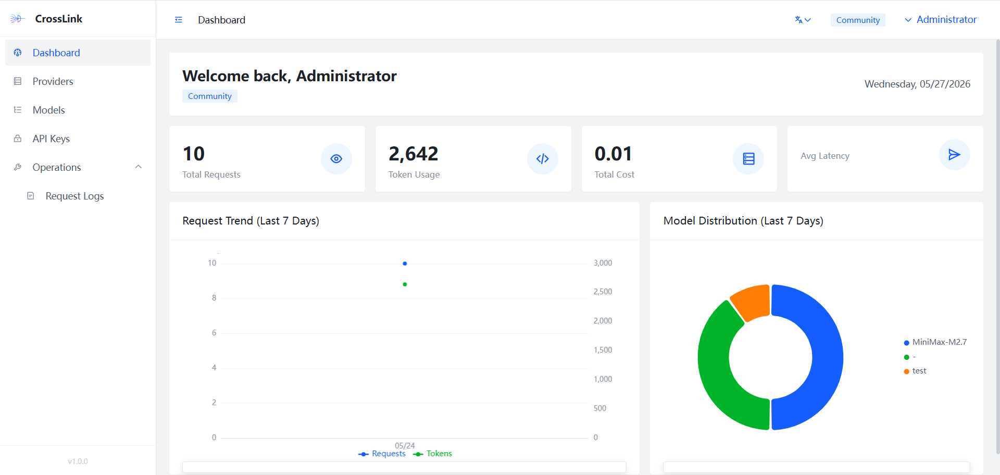
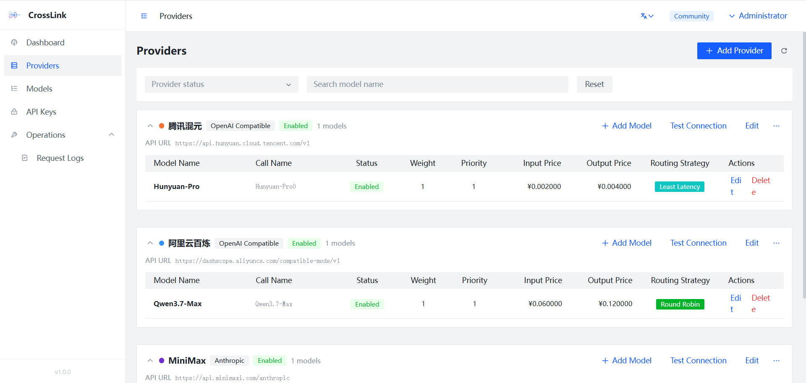
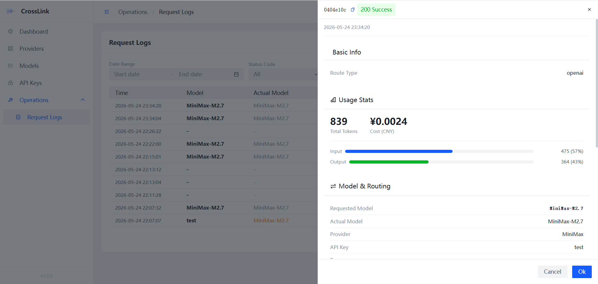

<div align="center">

# CrossLink

**Enterprise-grade LLM API Gateway Management Platform**

[](LICENSE)
[](https://vuejs.org/)
[](https://www.typescriptlang.org/)
[](https://vitejs.dev/)

[English](#-overview) | [中文](README_zh.md)

</div>

---

CrossLink is a production-ready API gateway designed for teams that need unified access to multiple LLM providers. It provides intelligent routing, real-time observability, and fine-grained access control through an intuitive management dashboard.

**This repository contains the web dashboard (frontend).** The backend service lives at [CrossLink](https://github.com/HotRiceNoodles/CrossLink).

## Why CrossLink?

Managing multiple LLM APIs is painful. Different providers, different pricing models, different failure modes. CrossLink solves this by sitting between your applications and LLM providers, giving you a single consistent API endpoint with:

- **Smart routing** that sends requests to the best model based on cost, latency, or custom weights
- **Automatic failover** so your users never see an outage
- **Real-time cost tracking** across all providers and models
- **Token-level access control** with budget limits and rate limiting

## ✨ Highlights

### Dashboard & Analytics

Real-time overview of your entire LLM infrastructure at a glance — request volumes, token consumption, cost breakdowns, and model usage distribution, all with interactive charts.



### Multi-Provider Management

Connect to DeepSeek, Qwen, OpenAI, Anthropic, and more through a pluggable adapter system. Each provider gets connectivity health checks, status monitoring, and unified configuration.



### Intelligent Model Routing

Six routing strategies to match your priorities:

| Strategy | Best For |
|---|---|
| **Weighted Random** | Gradual traffic shifting |
| **Round Robin** | Even load distribution |
| **Least Latency** | Speed-optimized applications |
| **Least Cost** | Budget-conscious deployments |
| **Canary** | Safe model rollouts |
| **Least Busy** | Maximum throughput |

### API Key Governance

Create keys with scoped model access, TPM/RPM limits, and daily/weekly/monthly budget caps. Secrets are shown only once at creation — just like they should be.

### Request Observability

Every request is logged with full traceability: which model was requested vs. which actually served, token breakdown, TTFT (Time To First Token), latency percentiles, fallback chains, cache hits, and guardrail events.



### Built-in Fault Tolerance

Automatic retry and fallback when a provider goes down. The system silently reroutes to healthy models while you see exactly what happened in the logs.

## 🛠 Tech Stack

| Layer | Choice |
|---|---|
| **Framework** | [Vue 3](https://vuejs.org/) + [TypeScript 5.7](https://www.typescriptlang.org/) |
| **Build** | [Vite 6](https://vitejs.dev/) |
| **UI** | [Arco Design Vue](https://arco.design/vue) |
| **State** | [Pinia](https://pinia.vuejs.org/) |
| **Charts** | [ECharts 5](https://echarts.apache.org/) |
| **i18n** | [vue-i18n](https://vue-i18n.intlify.dev/) — Chinese & English |

## 🚀 Getting Started

### Prerequisites

- **Node.js** >= 18
- **pnpm** (recommended) or npm
- **CrossLink backend** running on `localhost:8080` — see [CrossLink](https://github.com/HotRiceNoodles/CrossLink) for setup

### Install & Run

```bash
# Clone the repository
git clone https://github.com/HotRiceNoodles/CrossLinkweb.git
cd CrossLinkweb

# Install dependencies
pnpm install

# Start dev server (runs at http://localhost:5180)
pnpm dev
```

API requests are automatically proxied to `http://localhost:8080` in development mode.

### Build for Production

```bash
pnpm build
```

### Type Checking

```bash
pnpm type-check
```

## 📁 Project Structure

```
src/
├── api/              # API request layer (Axios + interceptors)
├── assets/           # Static assets & global styles
├── components/       # Shared components (Chart, etc.)
├── hooks/            # Composables (useLoading, useVisible, etc.)
├── layout/           # Layout shells (sidebar, navbar, breadcrumbs)
├── locale/           # i18n message bundles (zh-CN, en-US)
├── logger/           # Production-grade frontend logging module
├── router/           # Route definitions & navigation guards
├── store/            # Pinia state management
├── types/            # TypeScript type definitions
├── utils/            # Utility functions
└── views/            # Page components
    ├── dashboard/    # Analytics & system overview
    ├── provider/     # Provider CRUD & health checks
    ├── model/        # Model configuration & routing
    ├── key/          # API key lifecycle management
    ├── ops/          # Request logs & observability
    ├── login/        # Authentication
    └── profile/      # User settings
```

## 🧭 Roadmap

- [ ] Team management & RBAC
- [ ] Custom alerting rules
- [ ] Cost budget alerts (email/webhook)
- [ ] API playground for testing models
- [ ] Dark mode support
- [ ] Docker Compose one-click deployment

*Have an idea? [Open an issue](https://github.com/HotRiceNoodles/CrossLinkweb/issues) or start a discussion!*

## 🤝 Contributing

We welcome contributions of all sizes — bug fixes, features, docs, or even just reporting issues.

1. **Fork** the repository
2. **Create** a feature branch: `git checkout -b feat/my-feature`
3. **Commit** your changes: `git commit -m 'feat: add amazing feature'`
4. **Push** to your fork: `git push origin feat/my-feature`
5. **Open** a Pull Request

Please make sure `pnpm type-check` passes before submitting.

## 📄 License

This project is licensed under the [Apache License 2.0](LICENSE).

---

<div align="center">

**If CrossLink helps you manage your LLM APIs, consider giving us a star — it helps others find the project.**

[](https://star-history.com/#HotRiceNoodles/CrossLink-UI-Standard&Date)

</div>
