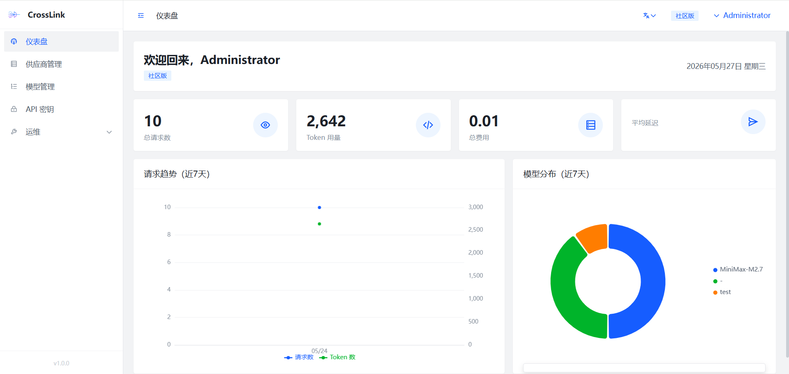
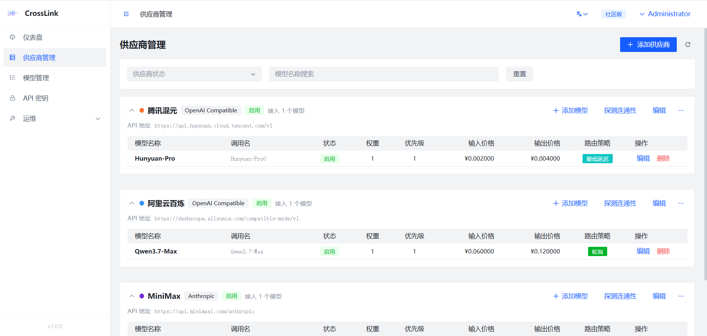
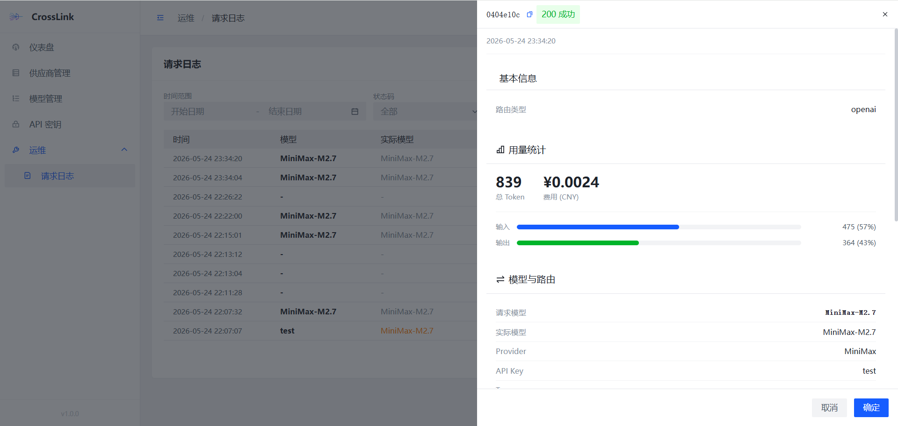

<div align="center">

# CrossLink

**企业级大模型 API 网关管理平台**

[](LICENSE)
[](https://vuejs.org/)
[](https://www.typescriptlang.org/)
[](https://vitejs.dev/)

[English](README.md) | [中文](#-概述)

</div>

---

CrossLink 是一个面向企业用户的 LLM API 网关，为需要统一对接多家大模型供应商的团队而设计。它通过直观的管理后台，提供智能路由、实时可观测性和细粒度访问控制。

**本仓库为管理后台（前端）。** 后端服务请移步 [CrossLink](https://github.com/HotRiceNoodles/CrossLink)。

## 为什么选择 CrossLink？

管理多个大模型 API 是一件痛苦的事——不同的供应商、不同的计费方式、不同的故障模式。CrossLink 解决了这个问题：它位于你的应用和 LLM 供应商之间，为你提供一个统一的 API 入口，并带来以下能力：

- **智能路由** — 根据成本、延迟或自定义权重，将请求发送到最优模型
- **自动故障转移** — 供应商不可用时自动切换，用户无感知
- **实时成本追踪** — 跨供应商、跨模型的费用一目了然
- **令牌级访问控制** — 支持预算上限与速率限制

## ✨ 核心特性

### 仪表盘与数据分析

一目了然的 LLM 基础设施全景视图——请求量、Token 消耗、成本拆解和模型使用分布，全部以交互式图表呈现。



### 多供应商管理

通过可插拔的适配器体系对接 DeepSeek、通义千问、OpenAI、Anthropic 等。每个供应商支持连通性健康检测、状态监控和统一配置管理。



### 智能模型路由

六种路由策略，满足不同优先级需求：

| 策略 | 适用场景 |
|---|---|
| **加权随机** | 渐进式流量迁移 |
| **轮询** | 均匀负载分配 |
| **最低延迟** | 延迟敏感型应用 |
| **最低成本** | 预算优先部署 |
| **金丝雀发布** | 安全的模型灰度上线 |
| **最闲优先** | 最大化吞吐量 |

### API 密钥治理

创建密钥时可限定可用模型、TPM/RPM 限制和日/周/月预算上限。密钥 Secret 仅在创建时展示一次——安全就该如此。

### 请求可观测性

每次请求都有完整链路记录：请求的目标模型与实际服务模型、Token 用量明细、TTFT（首 Token 延迟）、延迟分位数、降级链路、缓存命中和安全护栏触发事件。



### 内置容错

当供应商不可用时自动重试与降级。系统静默地将请求路由到健康模型，同时你在日志中能看到完整的故障链路。

## 🛠 技术栈

| 层级 | 选型 |
|---|---|
| **框架** | [Vue 3](https://vuejs.org/) + [TypeScript 5.7](https://www.typescriptlang.org/) |
| **构建** | [Vite 6](https://vitejs.dev/) |
| **UI** | [Arco Design Vue](https://arco.design/vue) |
| **状态管理** | [Pinia](https://pinia.vuejs.org/) |
| **图表** | [ECharts 5](https://echarts.apache.org/) |
| **国际化** | [vue-i18n](https://vue-i18n.intlify.dev/) — 中文 & English |

## 🚀 快速开始

### 环境要求

- **Node.js** >= 18
- **pnpm**（推荐）或 npm
- **CrossLink 后端**运行在 `localhost:8080` — 安装步骤见 [CrossLink](https://github.com/HotRiceNoodles/CrossLink)

### 安装与运行

```bash
# 克隆仓库
git clone https://github.com/HotRiceNoodles/CrossLinkweb.git
cd CrossLinkweb

# 安装依赖
pnpm install

# 启动开发服务器 (运行在 http://localhost:5180)
pnpm dev
```

开发模式下，API 请求会自动代理到 `http://localhost:8080`。

### 生产构建

```bash
pnpm build
```

### 类型检查

```bash
pnpm type-check
```

## 📁 项目结构

```
src/
├── api/              # API 请求层 (Axios 拦截器)
├── assets/           # 静态资源与全局样式
├── components/       # 通用组件 (Chart 等)
├── hooks/            # 组合式函数 (useLoading, useVisible 等)
├── layout/           # 布局组件 (侧边栏, 导航栏, 面包屑)
├── locale/           # 国际化语言包 (zh-CN, en-US)
├── logger/           # 生产级前端日志模块
├── router/           # 路由定义与导航守卫
├── store/            # Pinia 状态管理
├── types/            # TypeScript 类型定义
├── utils/            # 工具函数
└── views/            # 页面组件
    ├── dashboard/    # 数据分析与系统概览
    ├── provider/     # 供应商管理与健康检测
    ├── model/        # 模型配置与路由策略
    ├── key/          # API 密钥生命周期管理
    ├── ops/          # 请求日志与可观测性
    ├── login/        # 登录认证
    └── profile/      # 个人设置
```

## 🧭 路线图

- [ ] 团队管理与 RBAC 权限
- [ ] 自定义告警规则
- [ ] 成本预算告警（邮件 / Webhook）
- [ ] API 调试沙箱
- [ ] 深色模式
- [ ] Docker Compose 一键部署

*有想法？[提交 Issue](https://github.com/HotRiceNoodles/CrossLinkweb/issues) 或发起讨论！*

## 🤝 参与贡献

我们欢迎各种形式的贡献——Bug 修复、新功能、文档改进，哪怕只是提一个问题。

1. **Fork** 本仓库
2. **创建**功能分支：`git checkout -b feat/my-feature`
3. **提交**更改：`git commit -m 'feat: add amazing feature'`
4. **推送**到你的 Fork：`git push origin feat/my-feature`
5. **发起** Pull Request

提交前请确保 `pnpm type-check` 通过。

## 📄 许可证

本项目基于 [Apache License 2.0](LICENSE) 开源。

---

<div align="center">

**如果 CrossLink 对你的 LLM API 管理有帮助，欢迎给我们一个 Star — 这能帮助更多人发现这个项目。**

[](https://star-history.com/#HotRiceNoodles/CrossLink-UI-Standard&Date)

</div>
